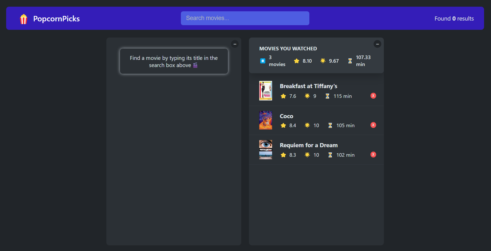

# PopcornPicks🍿

**Developer: Aleksandra Haniok**

### About

Explore your favorite movies, rate them & add them to your list!

This project showcases a simple React application that fetches movie data from a remote API using the useEffect hook. The project aims to demonstrate the basic usage of useEffect for data fetching and rendering the fetched data in a React components.

### Features

- Movie data is fetched from a remote API.
- Users can search for movies by entering keywords in the search field, which returns a list of relevant results
- View detailed information by clicking on a movie's title (such as poster, release date, duration, genre, IMDb rating, synopsis, cast, director and user rating.)
- Users can share their movie experiences by rating movies they've watched.
- Users can add movies to their favourites by clicking on a star rating or an "Add to favourites" button.
- Movies can be removed from favourites through a delete icon.

### Technologies used

- HTML5
- CSS3
- JavaScript
- React
- Vite - development build tool

### Learning

- Use the useEffect Hook to perform asynchronous operations.
- Use the localStorage to save the state of the application.
- Use the useRef hook to manipulate DOM in various intances.
- Create Custom Hooks in React.
- Manage state of the components.

### Acknowledgments

- The project was build as part of this [React course](https://www.udemy.com/course/the-ultimate-react-course/) with Jonas Schmedtmann.
